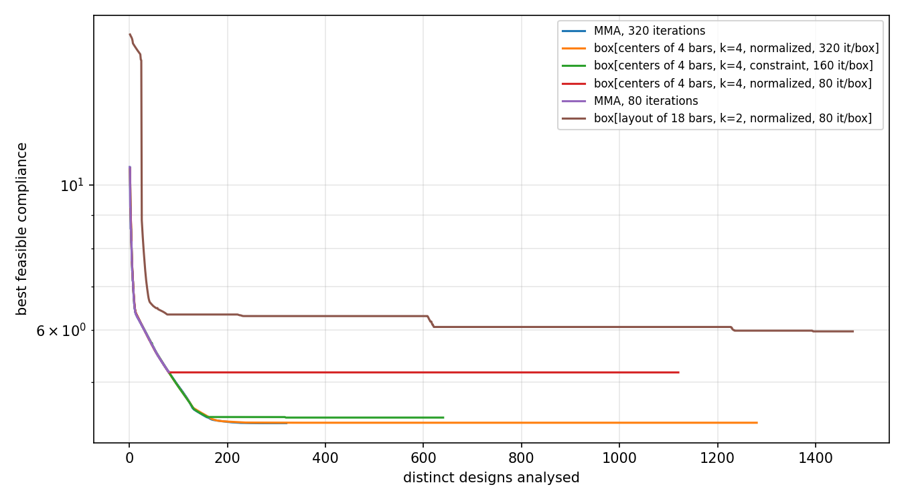

# Box subdivision on the Short Cantilever 2D

What the box-subdivision outer approximation
([gemseo-box-subdivision](https://github.com/SimoneConiglio/gemseo-box-subdivision))
does on the `short_cantilever` preset, against the single MMA run the preset
describes. Produced by `benchmarks/sc2d_box_subdivision.py`; every run uses the
preset's own MMA configuration (asymptotes, move limit) and the `direct` FE
solver, so the only thing that changes between rows is how the search is
organised.

## The runs

| Run | Best feasible compliance | Distinct designs | FE solves | Boxes solved | Time (s) |
|---|---|---|---|---|---|
| MMA, 320 iterations (the preset) | **4.3211** | 320 | 640 | -- | 144 |
| box, centres of 4 bars, k=4, normalized, 320 it/box | 4.3278 | 1280 | 1280 | 4 | 547 |
| box, centres of 4 bars, k=4, constraint, 160 it/box | 4.4072 | 640 | 644 | 4 | 517 |
| box, centres of 4 bars, k=4, normalized, 80 it/box | 5.1672 | 1120 | 1120 | 14 | 542 |
| MMA, 80 iterations | 5.1755 | 80 | 160 | -- | 38 |
| box, layout (Xc, Yc, θ) of 18 bars, k=2, normalized, 80 it/box | 5.9715 | 1476 | 1476 | 19 | 1045 |

*Distinct designs* is the unit the two methods share. The GGP disciplines
disable their caches, so a plain MMA run solves the same FE system twice per
iteration (value, then gradient) while the chain the box-subdivision scenario
builds caches it: the raw solve counts are not comparable, the design counts
are.

Every number above reproduced exactly on a repeat run.



The deep box run traces the plain MMA run exactly over its first box — that box
holds the preset's starting design — and then spends 960 further designs on
three more boxes without improving.

## What the runs say

**No configuration tried beat the plain MMA run, at any cost.** The closest,
four boxes of 320 MMA iterations each, reached 4.3278 for four times the
designs the baseline spends to reach 4.3211.

**That run found its best design inside its first box**, at design 320 of 1280 —
the box that contains the preset's own starting point. The three boxes the
master chose afterwards, each a different quarter-range for the four bar
centres, produced nothing better. The same holds for the constraint
formulation, whose best came from its second box and never improved over the
remaining two.

**Splitting the budget across boxes costs more than the exploration buys.** At
80 iterations per box the method spends 1120 designs to reach 5.1672, which one
MMA run reaches in 80 designs (5.1755). A box restarts the subdivided variables
at the centre of the box, which discards the preset's grid initialisation, and
80 iterations are not enough to earn it back; only at 320 iterations per box
does a sub-problem return to the baseline's neighbourhood.

**Subdividing more variables makes it worse, as the method's own documentation
warns.** Resolving the pose (Xc, Yc, θ) of all 18 bars puts 54 variables in the
subdivision and leaves every box starting from a design worth C ≈ 17; after 19
boxes and 1476 designs the run is at 5.97, the worst row of the table.

**The two formulations differ in exactly the way their descriptions say.** The
`constraint` formulation, which starts a sub-problem from the current design
projected into the box rather than from the box centre, keeps more of the
initialisation and reaches 4.4072 in 640 designs, where the `normalized`
formulation needs 1280 designs to reach 4.3278.

## Why this problem is not where the method pays off

The method targets a landscape whose basins the subdivision can resolve. The
SC 2D landscape, seen from the preset's initialisation, is close to unimodal in
the variables that were subdivided: `benchmarks/sc2d_local_minima.py` already
reports that continuation, multi-start, basin hopping, deflation, tunnelling and
chaotic search all improve on the baseline by at most about one percent. A
method whose unit of work is a full local solve inside a restricted box has to
pay several baselines' worth of designs before it can look at a second basin,
and here there is no second basin worth that much.

Two things would change the terms rather than the settings:

- **A cheaper unit of work.** Every box currently costs a converged MMA run on
  the full 108-variable problem. A coarser mesh or a shorter continuation
  schedule for the exploratory boxes, with the incumbent refined at full cost,
  would let the master look at many more boxes per baseline.
- **A subdivision of something other than raw bar coordinates.** 18
  interchangeable bars make the box space enormously symmetric: permuting two
  bars gives a different box with the same design. A subdivision over a
  permutation-invariant layout description would not waste the master's cuts on
  copies of the same structure.

## Reproducing

```shell
python benchmarks/sc2d_box_subdivision.py --baseline --max-iter 320
python benchmarks/sc2d_box_subdivision.py --baseline --max-iter 80

python benchmarks/sc2d_box_subdivision.py --subdivide centers --n-components 4 \
    --n-subdivisions 4 --master-max-iter 6 --n-parallel-points 1 --sub-max-iter 320
python benchmarks/sc2d_box_subdivision.py --formulation constraint \
    --subdivide centers --n-components 4 --n-subdivisions 4 \
    --master-max-iter 6 --n-parallel-points 1 --sub-max-iter 160
python benchmarks/sc2d_box_subdivision.py --subdivide centers --n-components 4 \
    --n-subdivisions 4 --master-max-iter 12 --n-parallel-points 2 --sub-max-iter 80
python benchmarks/sc2d_box_subdivision.py --subdivide layout --n-components 18 \
    --n-subdivisions 2 --master-max-iter 12 --n-parallel-points 2 --sub-max-iter 80

python benchmarks/sc2d_box_subdivision.py --summarize
```

The convexity margin was swept rather than calibrated in every box run
(`SweptBoxSubdivisionSettings`, the package's entry point that asks for no
margin), and the trust-region radius was left at its default of two.

Requires `gemseo-box-subdivision` (and `gemseo-bilevel-outer-approximation`,
which it installs) in the `ggp` environment:

```shell
pip install gemseo-box-subdivision
```
