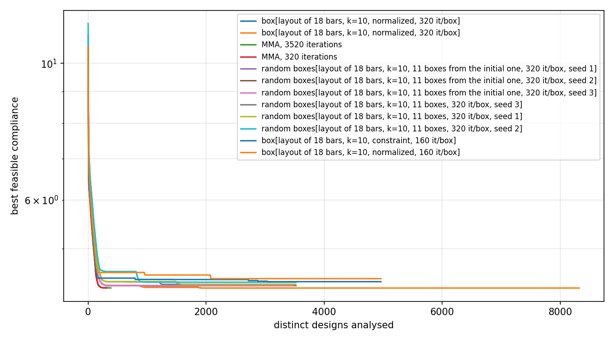

# Box subdivision on the Short Cantilever 2D

What the box-subdivision outer approximation
([gemseo-box-subdivision](https://github.com/SimoneConiglio/gemseo-box-subdivision))
does on the `short_cantilever` preset, against the single MMA run the preset
describes. Produced by `benchmarks/sc2d_box_subdivision.py`; every run uses the
preset's own MMA configuration (asymptotes, move limit) and the `direct` FE
solver, so the only thing that changes between rows is how the search is
organised.

In one sentence: a **coarse** subdivision of a few variables loses to the plain
MMA run at every budget tried, while a **fine** subdivision of the pose of every
bar, k = 10 over (Xc, Yc, θ), beats the converged baseline by 0.05% for eleven
times its cost — and the controls say the master's choice of boxes, rather than
the restarts, is what earns that.

## Coarse subdivisions: two to eight variables

| Run | Best feasible compliance | Distinct designs | FE solves | Boxes solved | Time (s) |
|---|---|---|---|---|---|
| MMA, 320 iterations (the preset) | **4.3211** | 320 | 640 | -- | 144 |
| box, centres of 4 bars, k=4, normalized, 320 it/box | 4.3278 | 1280 | 1280 | 4 | 547 |
| box, centres of 4 bars, k=4, constraint, 160 it/box | 4.4072 | 640 | 644 | 4 | 517 |
| box, centres of 4 bars, k=4, normalized, 80 it/box | 5.1672 | 1120 | 1120 | 14 | 542 |
| MMA, 80 iterations | 5.1755 | 80 | 160 | -- | 38 |
| box, layout (Xc, Yc, θ) of 18 bars, k=2, normalized, 80 it/box | 5.9715 | 1476 | 1476 | 19 | 1045 |

*Distinct designs* is the unit the two methods share. The GGP disciplines
disable their caches, so a plain MMA run solves the same FE system twice per
iteration (value, then gradient) while the chain the box-subdivision scenario
builds caches it: the raw solve counts are not comparable, the design counts
are.

Every number above reproduced exactly on a repeat run.


The deep box run traces the plain MMA run exactly over its first box — that box
holds the preset's starting design — and then spends 960 further designs on
three more boxes without improving.

## What the coarse runs say

**No coarse configuration beat the plain MMA run, at any cost**; the fine one
of the next section does. The closest here,
four boxes of 320 MMA iterations each, reached 4.3278 for four times the
designs the baseline spends to reach 4.3211.

**That run found its best design inside its first box**, at design 320 of 1280 —
the box that contains the preset's own starting point. The three boxes the
master chose afterwards, each a different quarter-range for the four bar
centres, produced nothing better. The same holds for the constraint
formulation, whose best came from its second box and never improved over the
remaining two.

**Splitting the budget across boxes costs more than the exploration buys.** At
80 iterations per box the method spends 1120 designs to reach 5.1672, which one
MMA run reaches in 80 designs (5.1755). A box restarts the subdivided variables
at the centre of the box, which discards the preset's grid initialisation, and
80 iterations are not enough to earn it back; only at 320 iterations per box
does a sub-problem return to the baseline's neighbourhood.

**More variables subdivided *coarsely* makes it worse.** Resolving the pose
(Xc, Yc, θ) of all 18 bars at k=2 puts 54 variables in the subdivision and
leaves every box starting from a design worth C ≈ 17; after 19 boxes and 1476
designs the run is at 5.97, the worst row of the table. It is the coarseness
rather than the count that does this: the same 54 variables at k=10 give the
best result in this file.

**The two formulations differ in exactly the way their descriptions say.** The
`constraint` formulation, which starts a sub-problem from the current design
projected into the box rather than from the box centre, keeps more of the
initialisation and reaches 4.4072 in 640 designs, where the `normalized`
formulation needs 1280 designs to reach 4.3278.

## A subdivision fine enough to move: (Xc, Yc, θ) of every bar, k = 10

The runs above resolve two to eight variables coarsely, and the coarseness is
what defeats them: a box of `k=2` sends the subdivided variables to a quarter or
three quarters of their range and discards the preset's initialisation. Ten
subdivisions of the **pose** of every bar — Xc, Yc and θ, the variables that
carry the multimodality — puts 54 variables in the subdivision, 540 binaries in
the master and 10⁵⁴ boxes in the design space, and each box is one tenth of the
range wide rather than one half. The master is untroubled by the binaries: it
grows with them, not with the boxes, and its MILP never showed up in the timing.

All runs below use the swept convexity, so no margin was supplied.

| Run | C | Distinct designs | Boxes | Designs to best | Time (s) |
|---|---|---|---|---|---|
| **box, master's boxes, 320 it/box** | **4.3188** | 3520 | 11 | 1920 | 898 |
| box, master's boxes, 320 it/box, longer | 4.3188 | 8320 | 26 | 1920 | 2162 |
| MMA, 3520 iterations (converges at 385) | 4.3210 | 385 | — | 384 | 184 |
| MMA, 320 iterations | 4.3211 | 320 | — | 320 | 144 |
| random boxes from the initial one, seeds 1/2/3 | 4.3569 | 3520 | 11 | 320 | ~1630 |
| random boxes, seeds 3/1/2 | 4.3583 / 4.3801 / 4.4142 | 3520 | 11 | — | ~1720 |
| box, master's boxes, constraint, 160 it/box | 4.4227 | 4960 | 31 | 3038 | 14556 |
| box, master's boxes, 160 it/box | 4.4730 | 4960 | 31 | 2080 | 1303 |



**This subdivision beats the converged baseline.** 4.3188 against 4.3210, by
0.05%. The baseline is converged rather than truncated: given 3520 iterations
MMA stops itself at 385 and reaches 4.32104, so no amount of further budget
takes it where the box run goes.

**The master's choice of boxes is what earns it**, which is what the controls
say and the reason to run them. Given the same subdivision and the same budget
— eleven boxes, 320 MMA iterations each, 3520 designs — boxes drawn uniformly
reach 4.3583, 4.3801 and 4.4142, all *worse* than the plain baseline. Starting
that draw from the box the preset's design falls in, which is the master's own
first box, gives 4.3569 on all three seeds: the best came from that first box
every time and not one of the ten random boxes after it improved on it. The
master, from the same first box and the same budget, reaches 4.3188. What
separates 4.3569 from 4.3188 is which box is looked at next.

**The budget per box decides whether any of this is visible.** At 160
iterations a box stops short of its own optimum, and 31 such boxes reach only
4.4730 — worse than 11 converged ones. The unit of work of this method is a
*converged* local solve; an under-solved box leaves the master cutting on a
value that is not the box's optimum.

**The gain is small and it arrives early.** 0.05% for eleven times the designs
of the baseline, found in the sixth box, and twenty-six boxes reach exactly the
same value as eleven. The objective spreads over 0.171 across the boxes the
master solved, which is the scale the sweep reads and a direct measure of how
flat this landscape is between boxes: there is little for the cuts to rank.

**The constraint formulation is not worth its cost here.** At the same design
count it took 14556 s against 1303 s — 54 box constraints make each MMA
sub-problem far heavier — and it reached 4.4227.

### Reproducing

```shell
python benchmarks/sc2d_box_subdivision.py --subdivide layout --n-components 18 \
    --n-subdivisions 10 --master-max-iter 8 --n-parallel-points 2 --sub-max-iter 320

# the controls
python benchmarks/sc2d_box_subdivision.py --subdivide layout --n-components 18 \
    --n-subdivisions 10 --random-boxes 11 --sub-max-iter 320 --seed 1
python benchmarks/sc2d_box_subdivision.py --subdivide layout --n-components 18 \
    --n-subdivisions 10 --random-boxes 11 --sub-max-iter 320 --seed 1 \
    --include-initial-box
python benchmarks/sc2d_box_subdivision.py --baseline --max-iter 3520
```

Numbers in `sc2d_box_subdivision_k10_results.csv`.

## Why the gain is this small

The method targets a landscape whose basins the subdivision can resolve. The
SC 2D landscape, seen from the preset's initialisation, is close to unimodal in
the variables those runs subdivided: `benchmarks/sc2d_local_minima.py` already
reports that continuation, multi-start, basin hopping, deflation, tunnelling and
chaotic search all improve on the baseline by at most about one percent. A
method whose unit of work is a full local solve inside a restricted box has to
pay several baselines' worth of designs before it can look at a second basin,
and here there is no second basin worth that much.

The k = 10 run above is that ceiling being reached rather than exceeded: it
finds a better basin, and the basin is 0.05% better. Two things would change the
terms rather than the settings:

- **A cheaper unit of work.** Every box currently costs a converged MMA run on
  the full 108-variable problem. A coarser mesh or a shorter continuation
  schedule for the exploratory boxes, with the incumbent refined at full cost,
  would let the master look at many more boxes per baseline.
- **A subdivision of something other than raw bar coordinates.** 18
  interchangeable bars make the box space enormously symmetric: permuting two
  bars gives a different box with the same design. A subdivision over a
  permutation-invariant layout description would not waste the master's cuts on
  copies of the same structure.

## Reproducing

```shell
python benchmarks/sc2d_box_subdivision.py --baseline --max-iter 320
python benchmarks/sc2d_box_subdivision.py --baseline --max-iter 80

python benchmarks/sc2d_box_subdivision.py --subdivide centers --n-components 4 \
    --n-subdivisions 4 --master-max-iter 6 --n-parallel-points 1 --sub-max-iter 320
python benchmarks/sc2d_box_subdivision.py --formulation constraint \
    --subdivide centers --n-components 4 --n-subdivisions 4 \
    --master-max-iter 6 --n-parallel-points 1 --sub-max-iter 160
python benchmarks/sc2d_box_subdivision.py --subdivide centers --n-components 4 \
    --n-subdivisions 4 --master-max-iter 12 --n-parallel-points 2 --sub-max-iter 80
python benchmarks/sc2d_box_subdivision.py --subdivide layout --n-components 18 \
    --n-subdivisions 2 --master-max-iter 12 --n-parallel-points 2 --sub-max-iter 80

python benchmarks/sc2d_box_subdivision.py --summarize
```

The convexity margin was swept rather than calibrated in every box run
(`SweptBoxSubdivisionSettings`, the package's entry point that asks for no
margin), and the trust-region radius was left at its default of two.

Requires `gemseo-box-subdivision` (and `gemseo-bilevel-outer-approximation`,
which it installs) in the `ggp` environment:

```shell
pip install gemseo-box-subdivision
```
