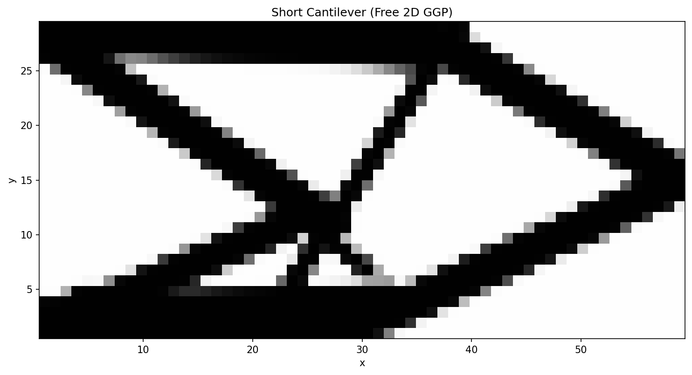

Short Cantilever
================

A GGP benchmark: a 60 × 30 beam clamped on the left face with a downward
point load at the mid-right edge.  Eighteen free bars optimise their
position, orientation, length, thickness, and membership density using the
AMNA (MNA) characteristic function.

Running
-------

.. code-block:: bash

   ggp optimize --preset short_cantilever

To save the density image directly into the documentation static folder:

.. code-block:: bash

   ggp optimize --preset short_cantilever --output-dir docs/_static

Result
------

   Optimized density field after 250 MMA iterations (40 % volume fraction, C = 74.3).

Problem details
---------------

+---------------------+------------------+
| Parameter           | Value            |
+=====================+==================+
| Domain              | 60 × 30          |
+---------------------+------------------+
| Mesh                | 60 × 30 quads    |
+---------------------+------------------+
| Formulation         | Free 2D          |
+---------------------+------------------+
| Method              | GP               |
+---------------------+------------------+
| Components          | 18               |
+---------------------+------------------+
| ``r_gp`` (σ)        | 0.5              |
+---------------------+------------------+
| Volume fraction     | 0.40             |
+---------------------+------------------+
| Algorithm           | MMA              |
+---------------------+------------------+
| Max iterations      | 250              |
+---------------------+------------------+
| Compliance          | 74.3             |
+---------------------+------------------+
