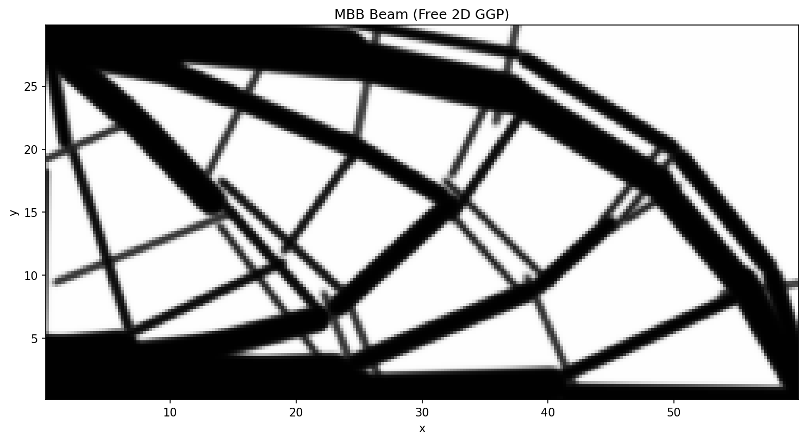

MBB Beam
========

The half-symmetry Messerschmidt-Bölkow-Blohm (MBB) beam is a classic
topology optimisation benchmark.  The left edge is a symmetry plane
(horizontal displacement blocked), the bottom-right corner has a vertical
roller, and the top-left corner carries a downward point load.

Running
-------

.. code-block:: bash

   ggp optimize --preset mbb

To save the density image:

.. code-block:: bash

   ggp optimize --preset mbb --output-dir docs/_static

Result
------

   Optimized density field after 400 MMA iterations (40 % volume fraction).

Problem details
---------------

+---------------------+------------------+
| Parameter           | Value            |
+=====================+==================+
| Domain              | 60 × 30          |
+---------------------+------------------+
| Mesh                | 120 × 60 quads   |
+---------------------+------------------+
| Formulation         | Free 2D          |
+---------------------+------------------+
| Method              | GP               |
+---------------------+------------------+
| Initial guess       | quad_star        |
+---------------------+------------------+
| Components          | 54 (cell 15)     |
+---------------------+------------------+
| ``r_gp`` (σ)        | 0.5              |
+---------------------+------------------+
| Min thickness       | 3 elements       |
+---------------------+------------------+
| Volume fraction     | 0.40             |
+---------------------+------------------+
| Algorithm           | MMA              |
+---------------------+------------------+
| Max iterations      | 400              |
+---------------------+------------------+
