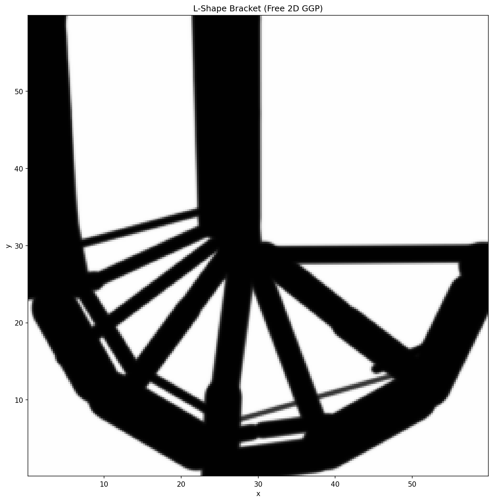

L-Shape Bracket
===============

An L-shaped structural bracket: a 60 × 60 square domain with the
upper-right quadrant voided (non-design region).  The top edge is fixed and
a downward point load is applied at the mid-right edge.

Running
-------

.. code-block:: bash

   ggp optimize --preset l_shape

To save the density image:

.. code-block:: bash

   ggp optimize --preset l_shape --output-dir docs/_static

Result
------

   Optimized density field after 400 MMA iterations (40 % volume fraction).

Problem details
---------------

+---------------------+------------------+
| Parameter           | Value            |
+=====================+==================+
| Domain              | 60 × 60 (L-shape)|
+---------------------+------------------+
| Mesh                | 120 × 120 quads  |
+---------------------+------------------+
| Formulation         | Free 2D          |
+---------------------+------------------+
| Method              | GP               |
+---------------------+------------------+
| Initial guess       | quad_star        |
+---------------------+------------------+
| Components          | 43 (cell 20)     |
+---------------------+------------------+
| ``r_gp`` (σ)        | 0.5              |
+---------------------+------------------+
| Volume fraction     | 0.40             |
+---------------------+------------------+
| Algorithm           | MMA              |
+---------------------+------------------+
| Max iterations      | 600              |
+---------------------+------------------+
| Compliance          | 75.6             |
+---------------------+------------------+
