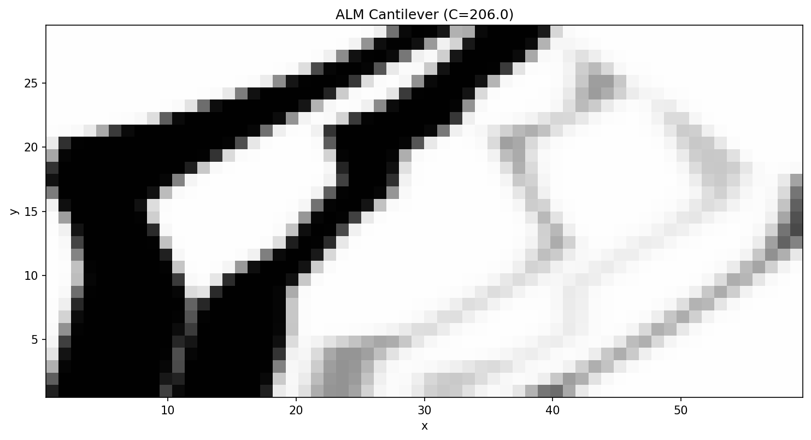

ALM Cantilever
==============

A cantilever optimised under Additive Layer Manufacturing (ALM) constraints.
The MNA continuous formulation arranges design variables in :math:`N_y = 10`
horizontal layers, each with :math:`N_p = 5` printed columns.  Linear
overhang constraints enforce a 45° self-support angle between adjacent layers.

Running
-------

.. code-block:: bash

   ggp optimize --preset alm_cantilever

To save the density image:

.. code-block:: bash

   ggp optimize --preset alm_cantilever --output-dir docs/_static

Result
------

   Optimized density field after 150 MMA iterations (40 % volume fraction, 45° overhang limit).

Problem details
---------------

.. list-table::
   :header-rows: 1
   :widths: 30 70

   * - Parameter
     - Value
   * - Domain
     - 60 × 30
   * - Mesh
     - 60 × 30 quads
   * - Formulation
     - ALM 2D (MNA continuous)
   * - Layers :math:`N_y`
     - 10
   * - Columns :math:`N_p`
     - 5
   * - Design variables
     - :math:`2 \times 10 \times 5 + 2 \times 5 + 2 = 112`
   * - Volume fraction
     - 0.40
   * - Overhang angle
     - 45°
   * - Algorithm
     - MMA
   * - Max iterations
     - 150

Variable Structure
------------------

Each design variable vector has the layout:

.. math::

   \mathbf{x} = [\underbrace{X_{c,0,0},\,L_{0,0},\;\ldots\;,X_{c,9,4},\,L_{9,4}}_{2 N_y N_p},\;
                 \underbrace{h_0,\ldots,h_4}_{N_p},\;
                 \underbrace{M_{c,0},\ldots,M_{c,4}}_{N_p},\;
                 y_0,\;\theta_0]

- :math:`h_j` — normalised total print height of column :math:`j`
- :math:`M_{c,j}` — membership density for the full column
- :math:`y_0`, :math:`\theta_0` — global printing-plane offset and rotation (both 0 here)

Overhang constraint (per layer interface, per column):

.. math::

   X_{c,k+1,j} + \tfrac{L_{k+1,j}}{2} - X_{c,k,j} - \tfrac{L_{k,j}}{2} &\le \Delta h \tan(45°)

   X_{c,k,j} - \tfrac{L_{k,j}}{2} - X_{c,k+1,j} + \tfrac{L_{k+1,j}}{2} &\le \Delta h \tan(45°)

To add a bridge-length constraint (limiting lateral drift from the base layer):

.. code-block:: yaml

   constraints:
     - name: overhang
       type: ineq
       bound: 0.0
       params:
         alpha_deg: 45.0
         bridge_length: 12.5
