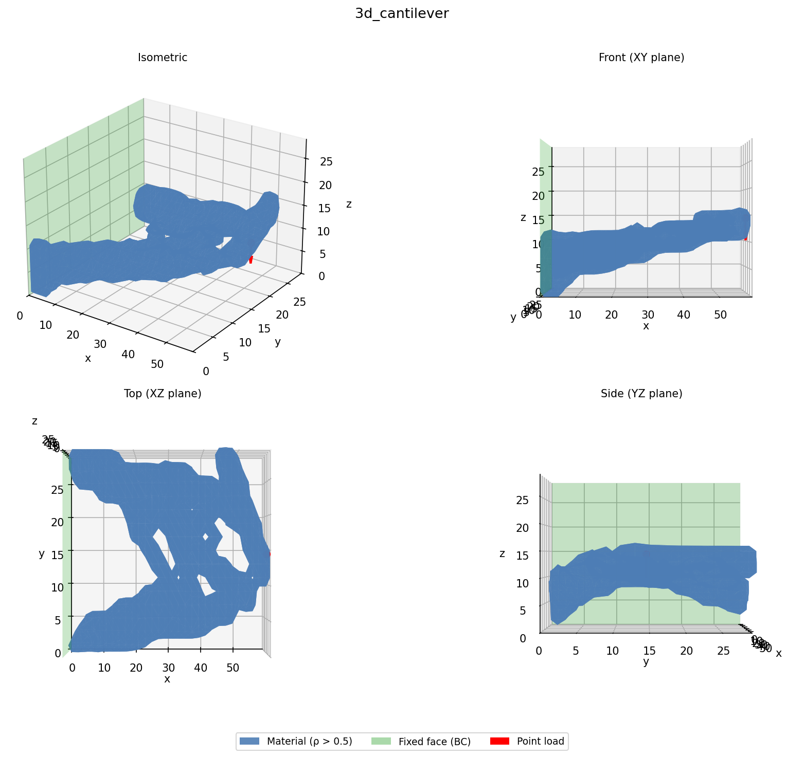

3D Cantilever
=============

A full 3D topology optimisation of a short cantilever beam (60 × 30 × 30)
using the Free 3D GGP formulation.  Each component is parameterised by
eight variables (centre position, length, width, two orientation angles, and
a density parameter), allowing arbitrary 3D orientations.

Running
-------

.. code-block:: bash

   ggp optimize --preset 3d_cantilever

To save the density image:

.. code-block:: bash

   ggp optimize --preset 3d_cantilever --output-dir docs/_static

The preset uses the **AMJax** FEM solver by default (``fem_solver: amjax``),
which is JIT-compiled, GPU-compatible, and handles 3-D systems efficiently.
The first iteration incurs a one-time JAX compilation overhead (~1–2 s);
subsequent solves are fast.  To fall back to the PETSc iterative solver:

.. code-block:: bash

   ggp optimize --preset 3d_cantilever --fem-solver iterative

Result
------

The figure below shows four views of the optimised 3D density field (isosurface
at ρ = 0.5, i.e. solid material only): isometric, front (XY plane), top (XZ
plane), and side (YZ plane).  The green face marks the fixed boundary condition;
the red dot and arrow mark the applied point load at the mid-right face.

   Four-view isosurface (ρ > 0.5) of the optimised 3D density field after 150
   MMA iterations (10 % volume fraction).

Problem details
---------------

+---------------------+------------------+
| Parameter           | Value            |
+=====================+==================+
| Domain              | 60 × 30 × 30     |
+---------------------+------------------+
| Mesh                | 30×15×15 tets    |
+---------------------+------------------+
| Formulation         | Free 3D          |
+---------------------+------------------+
| Components          | 20               |
+---------------------+------------------+
| Volume fraction     | 0.10             |
+---------------------+------------------+
| Algorithm           | MMA              |
+---------------------+------------------+
| Max iterations      | 150              |
+---------------------+------------------+
