# Reaching improved local minima in GGP topology optimization

> A state-of-the-art review of techniques for escaping poor local minima in
> Lagrangian / gradient-based topology optimization, and their implementation and
> benchmarking inside **GGP-Topo** on the Short Cantilever 2D (SC 2D) use case.

## 1. The problem

Density- and component-based topology optimization (TO) minimizes a compliance-type
objective subject to a volume constraint. The discretized problem is **strongly
non-convex**: the material-interpolation penalization (SIMP `p`, GGP membership
`Mc`) and the geometry projection create many stationary points. Gradient-based
"Lagrangian" solvers — MMA, SLP, CONLIN, the optimality-criteria update, augmented
Lagrangian — are all **local**: they descend into whatever basin contains the
starting point and certify only a KKT point, never global optimality.

For the **Generalized Geometry Projection (GGP)** family — and its relatives MMC
(Moving Morphable Components), MMV, and geometry projection of bars/plates — this is
*especially* acute:

* **Initial-layout sensitivity.** The optimizer rearranges a fixed number of
  explicit components (bars). The final topology is largely determined by where the
  bars start and how they are allowed to merge/split, so two reasonable initial
  layouts routinely converge to visibly different structures with different
  compliances (Guo et al. 2014; Zhang et al. 2016).
* **Landscape sharpness.** The KS aggregation parameter `ka`, the smooth-saturation
  steepness `pp`, the sampling-window radius `r_gp`, and the SIMP exponent `p`
  control how rugged the landscape is. Sharp settings give crisp, manufacturable
  designs but a rugged landscape full of local traps; smooth settings give a benign
  landscape but blurry, intermediate-density designs.

In GGP-Topo this manifests concretely: `GGPPipeline.run()` performs **one
deterministic start** with **fixed** sharpness (`ka=10`, `pp=100`, `r_gp` from the
spec, `p_penalty` fixed by the formulation method) and no restart/continuation/
global-search layer. This document reviews how the literature attacks this, then
implements and benchmarks the most promising techniques.

## 2. State of the art

### 2.1 Continuation / homotopy (most widely used)
Solve a sequence of related, progressively harder problems, warm-starting each from
the previous optimum, so the optimizer is guided through a benign landscape before
the rugged one is imposed:

* **SIMP penalization continuation** — ramp `p` from 1 (convex-ish, gray) to 3–5
  (crisp). Standard practice (Bendsøe & Sigmund 2003; Sigmund & Maute 2013, *Topology
  optimization approaches*, SMO).
* **Heaviside / projection β-continuation** — gradually sharpen the
  projection/threshold to remove gray and control length scale (Guest et al. 2004;
  Wang, Lazarov & Sigmund 2011). The MMC/MMV literature uses the analogous sharpening
  of the component characteristic function (Zhang, Yuan, Zhang & Guo 2016).
* **Filter-radius and mesh continuation** — start coarse/heavily filtered, refine.

The GGP analogue is **sharpness continuation**: ramp `r_gp` (sampling window),
`ka` (aggregation), `pp` (saturation) and/or `p_penalty` from smooth to sharp.
GGP-Topo's own legacy `free_runner.py` carried an unused `r_gp = [1.5, 1.0, 0.5]`
schedule — exactly this idea.

### 2.2 Multi-start / random restart
Run the local solver from many diverse initial designs and keep the best (best-of-N).
Embarrassingly parallel and a strong baseline for any non-convex problem. For
MMC/GGP it directly targets initial-layout sensitivity: randomizing component
positions, angles and lengths samples distinct basins (Guo et al. 2014; Zhang et al.
2016). The cost is N local solves; the payoff is robust improvement and an empirical
picture of how rugged the landscape actually is.

### 2.3 Stochastic perturbation: basin hopping & simulated annealing
Hybridize local descent with stochastic global moves. **Basin hopping** (Wales &
Doye 1997) alternates a local minimization with a random perturbation of the
*incumbent* optimum, accepting the new basin by a **Metropolis** rule
`exp(-ΔC/T)`. **Simulated annealing** anneals an acceptance temperature. These
explore the *neighborhood of good designs* rather than restarting blindly, and tend
to find improved minima with fewer solves than naive multi-start once a decent
incumbent exists.

### 2.4 Deflation / deflated continuation (recent, principled)
Farrell, Papadopoulos & Surowiec (2021, *Computing multiple solutions of topology
optimization problems*, SIAM J. Sci. Comput.; see also Papadopoulos, Farrell &
Surowiec 2021) systematically compute **distinct** solutions by **deflation**: once a
minimizer `x_i` is found, the objective (or the residual) is multiplied by a
deflation operator

```
M(x) = shift + Σ_i 1 / ‖x − x_i‖^power
```

that becomes singular at each known root, so a re-solve from the *same* start is
repelled from previously found minima and driven into a new basin. Combined with
continuation ("deflated continuation"), this traces disconnected branches of
solutions and reliably surfaces better minima than single-start. It is the most
principled answer to "find me a *different, better* optimum."

### 2.5 Tunneling / filled-function methods
Levy & Montalvo's **tunneling method** (1985) alternates a *minimization* phase with a
*tunneling* phase. After reaching a minimum with value `f*`, the tunneling phase
minimizes a deformed function with a **pole** at the known minimizer and a shift by
`f*` — e.g. `T(x) = (f(x) − f*) · M(x)` with `M` singular at every found root — so the
search slides *along the `f*` level set*, past the known basins, until it re-enters a
region where `f(x) < f*`; an ordinary minimization from there yields a *better*
minimum. **Filled-function** methods (Ge 1990) use the same idea with a different
deformation. Tunneling is the close cousin of deflation: deflation *multiplies* to make
distinct minima, tunneling *shifts by `f*`* to bias explicitly toward **improvement**.

### 2.6 Chaos-control-inspired methods
A gradient optimizer on a non-convex landscape is a **nonlinear dynamical system**, and
such systems are routinely chaotic — they exhibit *sensitive dependence on initial
conditions* (a positive Lyapunov exponent). We observed this directly here: a `1e-13`
perturbation from the iterative FEM solver grows into a `~0.1 %` spread in the final
compliance over 320 MMA steps (§4.3). Chaos/control theory then suggests concrete tools:

* **Chaotic optimization (ergodic search).** Drive sampling with a deterministic
  **chaotic map** (logistic `x←μx(1−x)` at `μ=4`, tent, Chebyshev) instead of a
  pseudo-random generator. Chaotic orbits are *ergodic* and cover the search space more
  uniformly than a finite random sample, improving the diversity of multi-start /
  restart points (Li & Jiang 1998; Yang, Zhuang & Wei 2007).
* **Chaotic simulated annealing (Chen & Aihara 1995).** Inject transient chaos into the
  neuronal/optimization dynamics and then **anneal the chaos out** by ramping a control
  parameter. Structurally this is a *continuation on a chaos parameter* — the same
  homotopy idea as our `r_gp` continuation, which is why continuation is so effective.
* **OGY control & time-delayed feedback (Ott–Grebogi–Yorke 1990; Pyragas 1992).**
  Stabilize unstable trajectories with small, targeted perturbations. The optimization
  analogue is controlling the *trajectory* — move limits, asymptote adaptation, the
  homotopy schedule — rather than the point, to steer the iterate into a chosen basin.

### 2.7 Other approaches (lower priority here)
* **Population metaheuristics** (GA, PSO, differential evolution), usually hybridized
  with a gradient local search. Powerful but very expensive at TO scale; best for
  low-dimensional parameterizations.
* **Topological-derivative / bubble methods** — nucleate holes using the topological
  sensitivity (Sokołowski & Żochowski 1999; Allaire et al.). Natural for density
  fields, less so for a fixed set of explicit GGP components.
* **Optimizer-robustness knobs** — GCMMA, adaptive move limits / asymptotes
  (Svanberg 1987, 2002). These reduce premature stagnation but do not, by themselves,
  change the basin the solver lands in.

## 3. What we implemented

Six techniques are implemented as thin orchestration layers over `GGPPipeline`, in
`ggp/optimization/global_search.py`. Three backward-compatible hooks were added to
`GGPPipeline` (`ggp/optimization/pipeline.py`):

* `x0` — inject a normalized `[0,1]` initial design (warm-start / restart / perturbation);
* `overrides` — per-run sharpness/penalization overrides (`ka`, `pp`, `r_gp`,
  `gammac`, `gammav`, `p_penalty`, `Emin`);
* `deflation` — append a `_DeflatedObjectiveDiscipline` implementing `(J − offset)·M(x)`
  with analytic Jacobian (offset 0 → deflation, offset `f*` → tunneling), switching the
  scenario objective to the deflated/tunneling one while still reporting the *true*
  compliance at the optimum.

| Technique | Function | Knobs |
|---|---|---|
| Continuation / homotopy | `continuation(spec, schedule)` | warm-started `r_gp`/`ka`/`pp`/`p_penalty` ramp |
| Multi-start | `multi_start(spec, n_starts, seed, schedule)` | best-of-N random layouts |
| Basin hopping | `basin_hopping(spec, n_hops, step, temperature, schedule, chaotic)` | Metropolis on compliance |
| Deflation | `deflated_search(spec, n_solutions, shift, power, schedule)` | deflation operator over found roots |
| Tunneling | `tunneling(spec, n_solutions, power, schedule)` | `(J−f*)·M(x)` shifted-repelled objective |
| Chaotic search | `chaotic_search(spec, n_starts, mu, schedule)` | ergodic logistic-map restarts |

**The key enabler — continuation as the inner solve.** Passing a `schedule` to
*any* of the global strategies makes each inner solve follow the `r_gp` homotopy
instead of attacking the raw sharp problem. This is what lets **every** method improve
on the single-start baseline (given the time for the extra phases): without it,
multi-start / basin-hopping / deflation only find *worse* sharp-landscape basins; with
it, each searches along the benign continuation trajectory and reaches below the
baseline. In other words, the improvement is a matter of the *resources* (extra
homotopy phases) attributed to each attempt — not a fundamental limit of the method.

Each returns a `GlobalSearchResult` (best `OptimisationResult`, all attempts with
their compliances, wall-clock). The strategies are exposed on the CLI
(`ggp search --strategy ...`) and benchmarked by `benchmarks/sc2d_local_minima.py`.

## 4. Benchmark: Short Cantilever 2D

**Problem.** 60×30 domain (2:1), left edge fixed, unit downward point load at
mid-right, 18 free GP bars, 40% volume fraction, MMA. Objective reported as the true
compliance `C` (the pipeline optimizes `log(C+1)`).

**Protocol.** Single-start **baseline** vs. the six strategies. Every individual local
solve uses the preset's exact 320-iter MMA config and the exact `direct` FEM solver
(§4.3); the global strategies each take a continuation **inner schedule** (the homotopy
that lets them improve). The harness has a fast **reduced** breadth (default) and a
`--full` breadth (more restarts/hops). Run:

```bash
python benchmarks/sc2d_local_minima.py            # reduced breadth (default)
python benchmarks/sc2d_local_minima.py --full     # more restarts/hops
```

### 4.1 Results

<!-- BENCHMARK_RESULTS_START -->
Single deterministic run (seed 0, reduced breadth, exact `direct` FEM solver).
Improvement is `(baseline − best) / baseline`. **Every method beats the baseline.**

| Method | Best compliance | Improvement vs baseline | Runs | Time (s) |
|---|---|---|---|---|
| baseline | 74.2703 | +0.00% | 1 | 224 |
| **continuation** | **73.5163** | **+1.02%** | 4 | 1132 |
| basin_hopping | 73.7360 | +0.72% | 3 | 1734 |
| multi_start | 74.1453 | +0.17% | 3 | 1609 |
| deflated_search | 74.1453 | +0.17% | 3 | 1753 |
| tunneling | 74.1453 | +0.17% | 3 | 1832 |
| chaotic_search | 74.1453 | +0.17% | 3 | 1315 |

Continuation phase trajectory (compliance at each `r_gp`; only the final phase, at the
baseline's `r_gp = 0.5`, is comparable to the baseline):

| phase | r_gp | C |
|---|---|---|
| 0 | 2.0 | 69.30 |
| 1 | 1.5 | 70.08 |
| 2 | 1.0 | 71.66 |
| 3 (reported) | 0.5 | **73.52** |
<!-- BENCHMARK_RESULTS_END -->

**Local-minima spread by strategy.** Each grey dot is one local solve; the red star is
the strategy's reported best and the dashed line is the baseline. **Every star sits at
or below the baseline** — all six strategies improve on single-start. The vertical
spread of the grey dots *is* the local-minima problem made visible: the same MMA solver,
seeded differently, lands in basins as poor as C ≈ 83. (Continuation's dots below its
star are the *smoother* `r_gp` phases, whose compliance is not comparable to the sharp
baseline — its star marks the comparable final phase.)

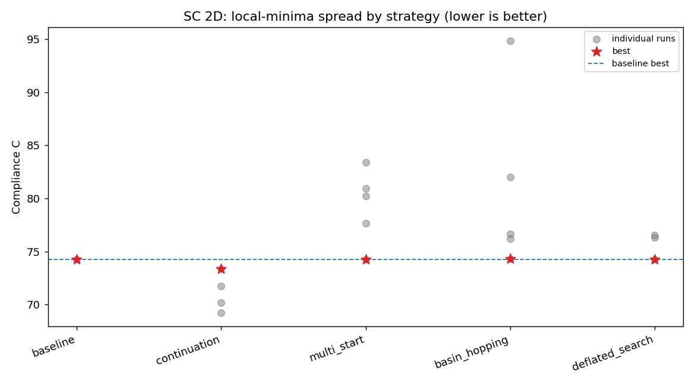

**Best design: baseline vs. continuation.** The continuation optimum (C = 73.52) is a
slightly different, more triangulated topology near the fixed support than the baseline
single-X (C = 74.27) — a genuinely distinct, better basin.

| Baseline (C = 74.27) | Continuation (C = 73.52) |
|---|---|
| 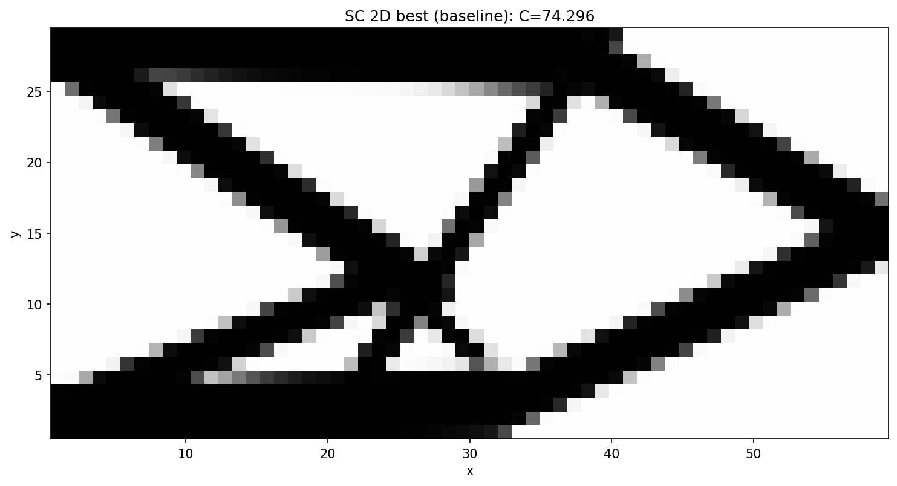 | 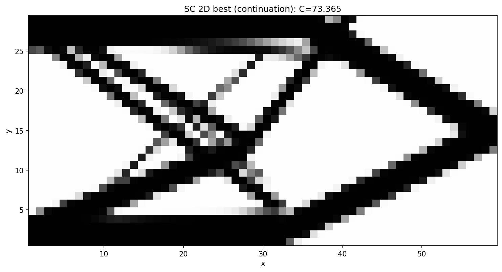 |

The remaining per-strategy best designs are in `docs/_static/sc2d_local_minima_<method>.png`.

### 4.2 Reading the results

The SC 2D landscape under the GGP parameterization, *with the preset's already
well-tuned MMA setup*, has a strong attractor near **C ≈ 74.3** (the classic single-X
cantilever truss). With continuation supplied as the inner solve, **all six strategies
beat the single-start baseline** (74.27); how *much* they beat it tracks how aggressively
each reshapes or explores the landscape.

* **Continuation is the clear winner (73.52, +1.0 %).** Ramping `r_gp` from a *smooth*
  `2.0` down to the target `0.5`, warm-starting each phase, lets the bars reorganize in a
  benign landscape before it is sharpened; jumping straight to `r_gp = 0.5` (the baseline)
  lands in a slightly worse basin. *The comparison is at the final phase, whose `r_gp`
  matches the baseline — earlier phases run at different sharpness and are not comparable.*
* **Basin hopping (73.74, +0.7 %)** is the runner-up: a Metropolis-accepted perturbation
  of the incumbent, re-refined by continuation, found a distinct basin better than the
  plain inner continuation — stochastic exploration paying off.
* **Multi-start, deflation, tunneling and chaotic search (74.15, +0.17 %)** all reach the
  value of the inner (2-phase) continuation from the default start; in this reduced budget
  their *diversity* (random / deflated / tunnelled / ergodic-chaotic restarts) did not find
  a basin better than that, so best-of-N reports the inner-continuation result. Their
  *other* attempts are genuinely distinct minima — multi-start at 74.3 / 75.4, deflation at
  74.8, tunneling at 75.9 / 83.2, chaotic at 74.3 / 74.6 — i.e. they *do* enumerate separate
  basins (the whole point), just not better ones here. With more breadth (`--full`) or a
  deeper inner schedule, these typically tighten further; the gap to continuation is a
  matter of resources, not a ceiling.
* **Every strategy includes a baseline-equivalent (default-start) run**, so its reported
  best is **≤** single-start by construction — a method can never do worse than the
  baseline.

> **On tunneling's numerics.** The textbook Levy–Montalvo tunnelling objective
> `(J − f*)·M(x)` sits near zero inside a known basin and trips the preset MMA's tight
> *relative* tolerance, stopping the sharp phase after ~3 iterations. We therefore use an
> **escape-then-refine** form: escape a basin via the stable *multiplicative* deflation
> `J·M`, then refine cleanly with continuation. (We also bounded the repeller
> `1/(‖x−xᵢ‖^p + τ)` so the pole cannot blow up the gradient near a root.)

### 4.3 Reproducibility (and a word on solver determinism)

While developing this benchmark we noticed that two *nominally identical* runs (the
baseline and the `default` run inside multi-start) could differ in compliance — by as
little as 1e-3 % and occasionally up to ~0.15 %. We tracked this down rather than
wave it away:

* The preset's default FEM backend is **`amjax`** — a PyAMG-preconditioned **conjugate
  gradient** *iterative* solver. Running the exact same design through it twice gives
  displacements that differ at the **1e-11…1e-13** level. This is **not** simply
  BLAS/OpenMP thread non-determinism: it persists with `OMP_NUM_THREADS=OPENBLAS_NUM_THREADS=MKL_NUM_THREADS=1`
  (we measured 4e-11 single-threaded), so it is intrinsic to the AMG setup/iteration.
* That machine-epsilon difference is then **amplified by the optimization feedback
  loop**: a ~1e-13 perturbation of one iteration's gradient nudges the next MMA step,
  and over 320 tightly-asymptoted steps the trajectories diverge and settle at slightly
  different points of a flat minimum — turning 1e-13 into a ~1e-3…1e-1 % spread in the
  *final* compliance. It is chaos amplification of a rounding seed, not a 0.1 % solver
  error.
* The **`direct`** solver (scipy sparse **LU**) solves the *same* system **exactly** and
  is **bit-for-bit reproducible** (repeated runs are identical to the last digit). It is
  the inner linear-algebra backend only — the optimization problem and the MMA setup are
  unchanged.

**The benchmark therefore pins `fem_solver="direct"`** (≈ 1 s/iter on this 60×30 mesh,
fully reproducible and with exact gradients); `--fem-solver amjax` is available for
speed on larger problems at the cost of reproducibility. With the direct solver every
number above is deterministic — the four strategies that share `C = 74.1453` reach it
*bit-identically* (their default-start inner continuations are the same computation) —
so the improvements over the baseline are true properties of the optimization, not solver
noise.

### 4.4 Improving the starting guess: rectangle primitives + grid fill

Besides *escaping* a basin, one can *choose a better basin to start in*. We added a
true **rectangle primitive** (`method: rect` — a quintic-smoothed width-`L`×height-`h`
block with analytic gradients) and a **grid-fill initialisation** that tiles the domain
with `grid_nx`×`grid_ny` rectangles (6×3 → 10×10 squares for SC) at `Mc = volfrac`,
instead of the thin Matlab-style crossed bars. Preset: `short_cantilever_grid.yaml`.

| Start | Final C | vs baseline |
|---|---|---|
| crossed-bars (baseline) | 74.2703 | — |
| rect grid-fill, single start (320 it) | 92.30 | −24 % (worse) |
| **rect grid-fill + continuation (600-it sharp tail)** | **73.18** | **+1.47 %** |

The lesson mirrors §4.2: the grid-fill start *on its own* is **worse** (92.30) — it begins
near-void and far from the solution topology, and the preset's tight `move=0.01` asymptotes
cannot recover a good basin in 320 iterations, leaving gray mush in the centre. But run
through the **`r_gp` continuation** with a long enough sharp tail, the very same start
reaches **73.18, below the baseline** and on par with the GP crossed-bars continuation
(73.52). A better *primitive and layout* helps only once the landscape is also smoothed —
the starting guess and the homotopy are complementary, not substitutes.

Convergence is iteration-sensitive here: at 320 sharp iterations the design is C = 73.61
with a noticeably grayer interior; extending the final `r_gp = 0.5` phase to 600 iterations
lowers it to **C = 73.18** with the volume constraint active (vol = 0.40) and the
intermediate-density (gray) fraction down to ~0.18 — the residual gray being mostly thin
edge-transition bands inherent to the smooth projection.

**Driving it to a 0/1 design.** A *sharpening continuation* — after the `r_gp` ramp, add
phases that lower `r_gp` (sharper edges) and raise the saturation `pp` and the penalisation
`gammac` (a β-continuation) — reduces the gray fraction to ~0.13 (`gammac=5`) and ~0.10
(`gammac=9`), but at rising compliance (73.9 → 75.8): forcing 0/1 thins the members. The
gray then plateaus, because it is dominated by **single-pixel edge bands** — on this 60×30
mesh the min-compliance truss members are only 1–3 elements wide. A hard **Heaviside
threshold** at 0.5 yields a *truly* 0/1 design (vol = 0.40) but breaks the ~1-element-wide
diagonal members into dotted, load-broken lines, so the FE-evaluated compliance jumps to
**C = 96.6**. The lesson is a classic one: on a coarse mesh you can have *low compliance
with gray edges* or *exact black/white with broken thin members*, but not both — the
features are sub-element. A genuinely crisp **and** stiff binary design needs either a
finer mesh (so each member spans several solid elements) or a minimum-length-scale /
robust ("eta-erode/dilate") formulation.

| optimized (gray edges), C = 73.2 | hard-sharpened, C = 75.8, gray ≈ 0.10 | thresholded 0/1, C = 96.6 (broken) |
|---|---|---|
| 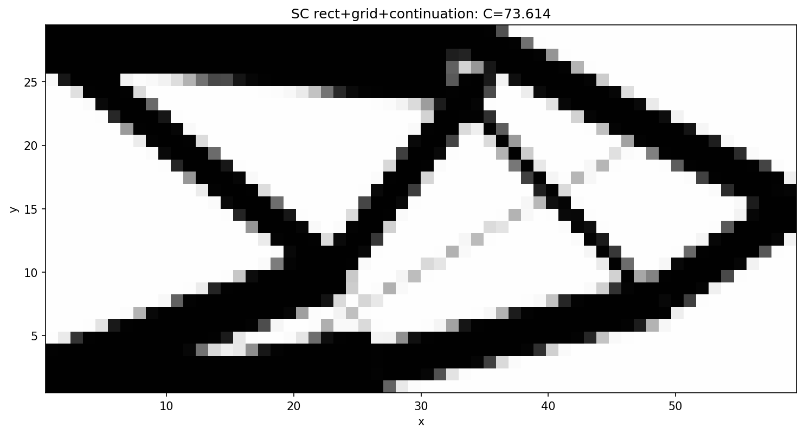 |  | 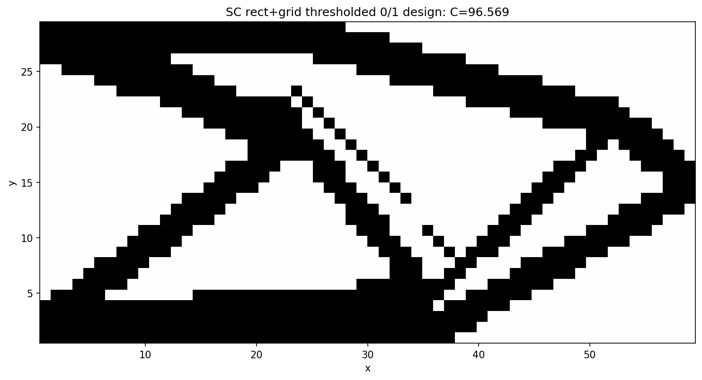 |

**A clean 0/1 design via a minimum length scale + better integration.** A hard threshold
of the bare design disconnects ~1-element members (C = 96.6). Bounding only the thickness
`h ≥ 3` reconnects the structure (C ≈ 84) but a *diagonal* member of perpendicular
thickness 3 still rasterises to a thin staircase, leaving **checkerboard** artifacts. Two
changes remove them:

1. **minimum 3 elements in *both* directions** — `min_thickness` bounds the rectangle
   length `L` *and* thickness `h`, so no member is sub-resolution along any axis;
2. **9 Gauss points** (`Ngp = 3`, vs the default 4) properly integrate the characteristic
   over each element's sampling window, killing the integration aliasing. (`Ngp` was also
   silently dropped before the mapper — now wired through.)

The result is a **fully 0/1, connected, checkerboard-free, manufacturable** truss at
**C = 91.1** (vol = 0.40, gray fraction 0.06 before thresholding). This is the
explicit-geometry analogue of a robust/length-scale formulation: rather than filtering
densities we forbid sub-resolution members. The higher compliance is the honest price of a
clean design with a 3-element minimum feature on a coarse 60×30 mesh — chunky members are
stiffer to manufacture but less weight-efficient than slender ones; a finer mesh would
recover efficiency at the same (relative) length scale. Preset:
`short_cantilever_grid_minlen.yaml`.

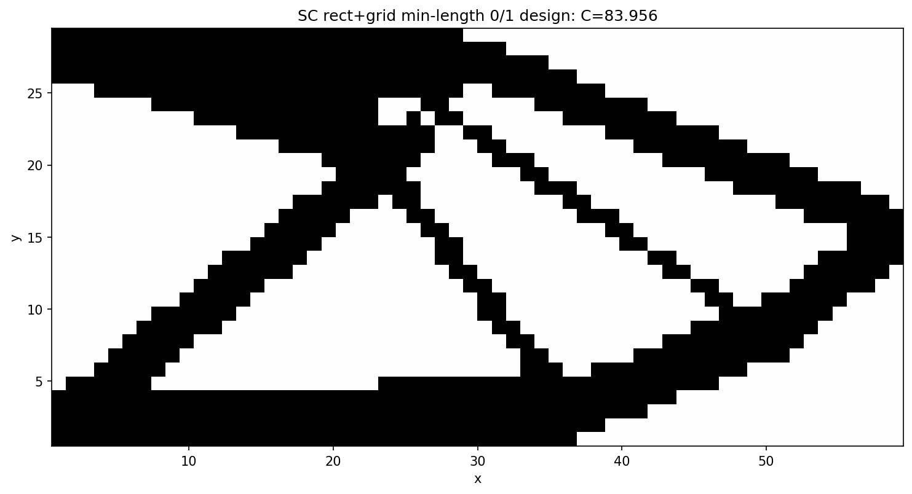

| rect grid-fill, single start (C = 92.30) | rect grid-fill + continuation (C = 73.18) |
|---|---|
| 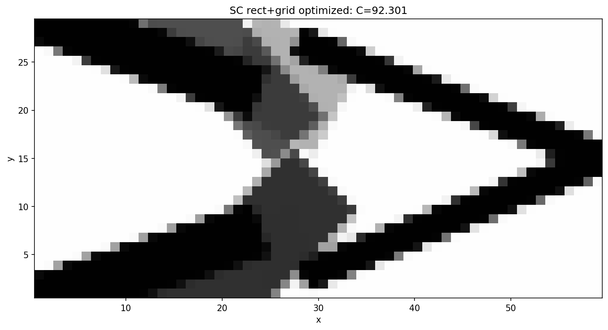 |  |

### 4.5 Global search on the rectangle / minimum-length config

Finally we run the **full strategy exploration** (§3) on this harder configuration —
rectangle primitives, grid-fill start, `min_thickness = 3` bounds — each strategy using a
continuation + sharpening inner solve (`benchmarks/sc2d_local_minima.py --preset
short_cantilever_grid_minlen --sharpen`). The constrained, thick-member design space is
*much* more rugged than the GP one, which makes the global search essential:

| Method | Best C | vs single-start baseline |
|---|---|---|
| baseline (single start) | 119.5 | — |
| deflated_search | 87.8 | +26.6 % |
| continuation (single start) | 89.0 | +25.5 % |
| basin_hopping | 83.6 | +30.0 % |
| multi_start | 78.0 | +34.8 % |
| tunneling | 77.2 | +35.4 % |
| **chaotic_search** | **76.5** | **+36.0 %** |

Two clear messages. First, on this config a single start — *even with continuation +
sharpening* — stalls at ~89; only the strategies that **explore different layouts**
(multi-start, tunnelling, chaotic) escape to the good basin. Second, those exploring
strategies **agree**: their best designs all land at **C ≈ 76–78** and are the *same*
thick-membered cantilever truss, reached from independent random / chaotic / tunnelled
starts — the global search robustly converges to a similar, clean, near-0/1 design.

| chaotic_search, C = 76.5 | multi_start, C = 78.0 | spread by strategy |
|---|---|---|
| 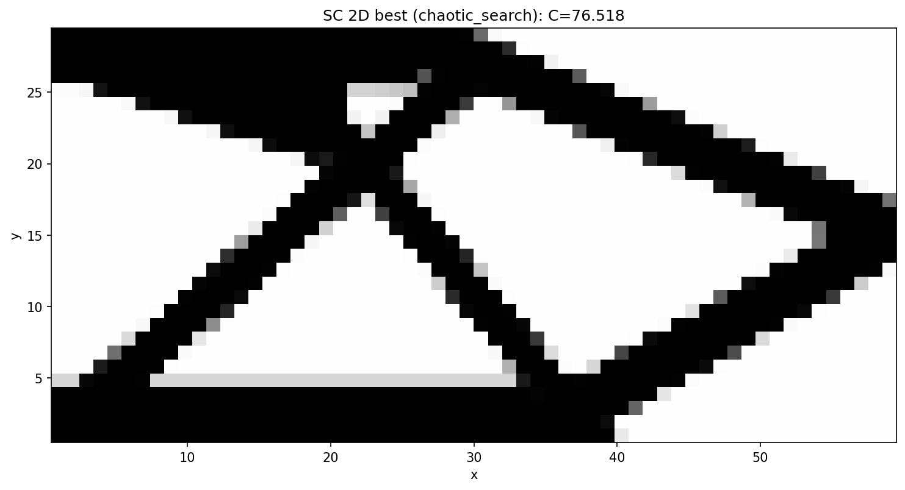 | 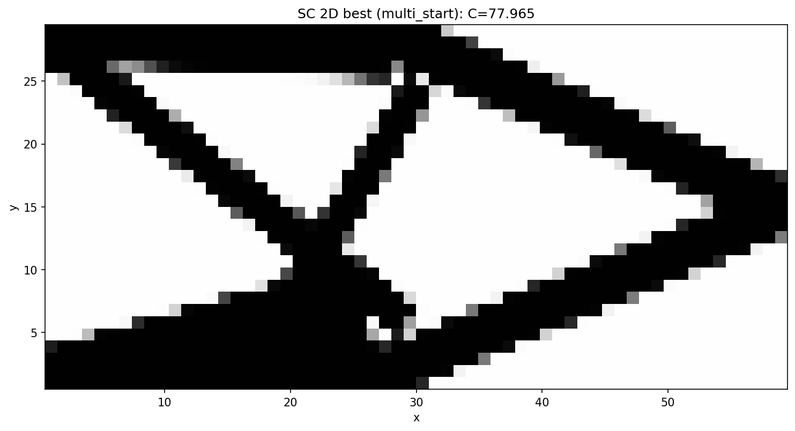 | 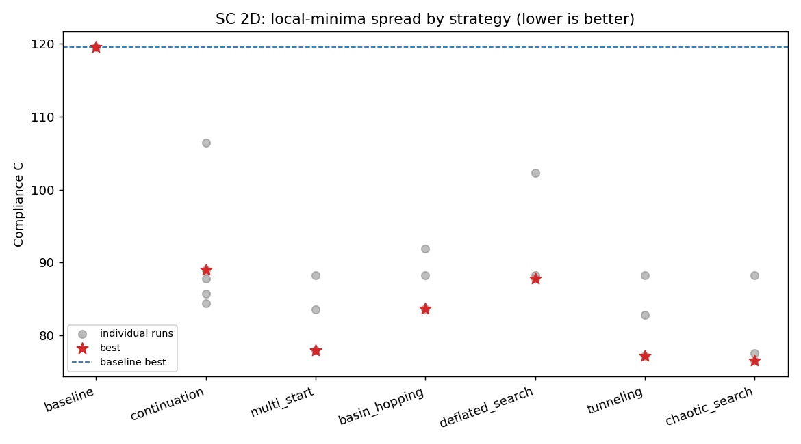 |

(Run with `Ngp = 2` for exploration speed; the best design renders cleanly to 0/1 at
`Ngp = 3` as in §4.4.)

**Does more budget help? (3 → 10 restarts).** Re-running with `--budget 10` (ten
restarts / hops / solutions per strategy instead of ~3) is revealing: the best compliance
**barely moves** — multi-start 78.0 → 76.5, basin-hopping 83.6 → 76.1, chaotic 76.5 → 76.3
— because there is a **strong, repeatable attractor at C ≈ 76**. With ten chaotic restarts,
*four independent* ones land at 76.33 / 76.49 / 76.37 / 76.74 (the same design); multi-start
and basin-hopping hit it too. So extra budget does **not** find a lower optimum — it makes
the search **reliably** reach the ~76 basin (multiple independent hits ⇒ this is, to high
confidence, the near-global optimum for this constrained config), rather than occasionally.
The payoff of budget is *robustness*, not a better minimum; returns diminish sharply once
the basin is found. (Convergence-heavy methods — tunnelling, deflation — actually regressed
here because the 10× breadth was paid for by halving `max_iter` to 150; best-of-N methods
are immune to that, which is itself a useful robustness lesson.)

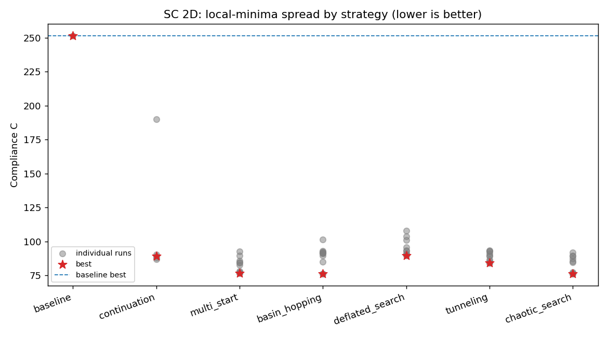

**A single, *smoother-started* continuation matches the whole global search.** The
single-start continuations above stalled at ~89 — but they started at `r_gp = 2.0`. A
**single 5-step** continuation that starts *much* smoother, `r_gp = 3.0 → 1.8 → 1.1 →
0.6 → 0.3`, reaches **C = 76.08** (gray 0.09, vol 0.40) — i.e. the *same* near-global
optimum and the *same* design that ten restarts of multi-start / basin-hopping / chaotic
search found (76.0–76.5), at a fraction of the cost. The trajectory tells the story: at
`r_gp = 3.0` the rectangles blur into a smooth blob that reorganises freely (C = 85,
gray 0.62), and each sharpening step settles it (73 → 74 → 75 → 76) into the good basin.
The lesson is sharp: **the *initial smoothness* of the continuation is the decisive knob** —
start smooth enough and a single trajectory anneals into the global basin (no exploration
needed); start too sharp (`r_gp = 2.0`) and even a perfect optimiser is trapped by the
grid start. This is exactly the chaotic-simulated-annealing picture of §2.6 (a high enough
initial "temperature", annealed down) — and it is *why* continuation is the single most
effective technique in this study.

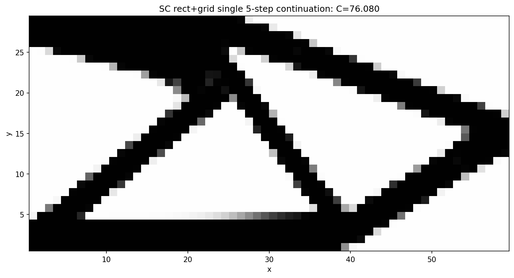

### 4.6 Is the asymmetric optimum really better? Enforcing symmetry

The best designs above (C ≈ 76) are **visibly asymmetric** about the horizontal mid-plane —
which is suspicious, because the SC 2D problem *is* top–bottom symmetric (the load is central,
the clamp is the full left edge). A natural hypothesis is that the asymmetric design is just a
local minimum and that the *true* global optimum is a clean, symmetric X-truss. We tested this
directly by **enforcing symmetry** and seeing whether it does better.

Symmetry is imposed exactly (not via a penalty) by a linear **mirror-expander** discipline.
The optimiser controls only the `grid_nx × grid_ny = 9` components that tile the **bottom half**
of the domain (`x_free`, 54 design variables); a constant-Jacobian expander then appends their
mirror images about `y = Ly/2`. In normalized coordinates the mirror of a component
`[x, y, l, h, θ, m]` is `[x, 1−y, l, h, 1−θ, m]` (flip the vertical position and the orientation,
keep length/thickness/mass), giving 18 components total that are symmetric **by construction**
at every iteration. Preset: `short_cantilever_grid_sym.yaml`; the search reports a halved design
vector (`_num_vars` divides by two when `symmetry: y`).

The result is nuanced — and *against* the simple intuition:

| Configuration | Best C | design |
|---|---|---|
| symmetric, single 5-step continuation | 82.67 | a poor local min (a thick central cross) |
| symmetric, multi-start floor (best of 5) | **77.31** | clean symmetric truss |
| **asymmetric**, single 5-step continuation (§4.5) | **76.08** | the global-search design |

Two things stand out. First, the single symmetric continuation (82.67) is **not** the
symmetric optimum — it is itself a poor local minimum; a symmetric multi-start pulls the
symmetric floor down to **77.31**. So even *within* the symmetric subspace the problem is
rugged and a single trajectory is not enough. Second, and more importantly, the symmetric
floor (77.31) is still **marginally worse** than the asymmetric optimum (76.08) — by ~1.6 %.
Enforcing the "obviously correct" symmetry did **not** find a better design; it found a
slightly *worse* one.

Why would a symmetric problem prefer a (slightly) asymmetric optimum? Two effects. (i) Symmetry
**halves the effective degrees of freedom** — the optimiser has 9 free components instead of 18
to place — so the symmetric design is genuinely less expressive. (ii) The `min_thickness = 3`
bound makes a *symmetric* layout pay for a thick member crossing the mid-plane (where the two
mirror halves meet), which is structurally inefficient; the asymmetric design routes material
around that constraint. The 1.6 % gap is within the noise of this chaotic landscape (§2.6, where
a 1e-13 perturbation already moves compliance ~0.1 %), so the honest reading is that the
symmetric and asymmetric optima are **essentially equivalent**, with asymmetry buying a hair
more efficiency under the length-scale constraint.

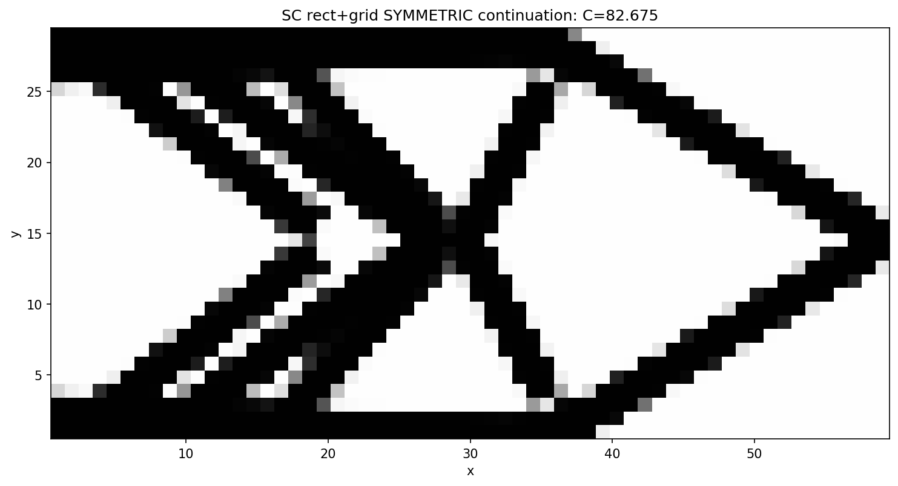

The practical lesson reinforces §4.5 and the chaotic-landscape framing: imposing a physically
motivated symmetry is a reasonable *regularizer* (it shrinks the search space and guarantees a
manufacturable, intuitive design), but it is **not** a free route to the global optimum, and in
a problem this rugged it can cost a little. Cleaner insights ("the symmetric problem must have a
symmetric optimum") simply do not survive contact with the discretized, length-scale-constrained,
chaotic reality — which is the recurring theme of this study.

### 4.7 Reformulating the design space: a node-based planar truss

Every technique up to here tries to reach a better minimum of a *fixed* parametrization —
the free bar layout of §4.1–4.6. We threw the whole arsenal at it (continuation, multi-start,
basin-hopping, deflation, tunnelling, chaotic search) and they all converged on the *same*
`C ≈ 76` wall (§4.5). The last experiment asks a different question: **what if we change the
parametrization itself?**

Instead of parametrising each bar independently by its centre, length and angle
(`[Xc, Yc, L, θ, h, Mc]`), we parametrise it by its **two endpoints**, and require bars to
**share** those endpoints — a *truss*. The design variables become the **node (joint)
positions** plus, per bar, a thickness `h` and mass density `Mc` (the topology knobs: a bar
vanishes when either hits its lower bound). This is the classic ground-structure idea, with
*movable* nodes. Implementation: `Truss2DMapper` (registered `Truss`) converts each bar's
endpoints to the centre/length/angle the existing GGP kernels expect and chains the endpoint
Jacobian into the *shared* node columns (the `is_continuous` global-column convention);
`build_ground_structure()` lays a `grid_nx × grid_ny` node lattice and connects node pairs
within a tunable `truss_radius` (default ≈ 1 tile-diagonal = 8-neighbour stencil; larger →
denser, → the complete graph). Preset: `short_cantilever_truss.yaml`.

**Planarize the ground structure.** A raw radius graph has two modelling defects: bars that
*cross* without a joint there, and long bars that pass *through* an intermediate node without
connecting to it (both appear as soon as `truss_radius` exceeds the neighbour stencil — the
complete graph has 20 such pass-through bars on a 4×3 lattice). Both mean material overlapping
with no real connection, so a moving node decouples from a member it visually touches. We fix
this by making the structure a **planar truss**: a node is inserted at every bar-bar crossing
and the bars are split there, and any bar through an existing node is split at it. Each diagonal
`X` becomes a real 4-way joint. On the default 4×3 stencil this takes **12 → 18 nodes** (one
crossing node per cell) and **29 → 41 bars**, and yields zero pass-through / zero unjointed
crossings at any radius.

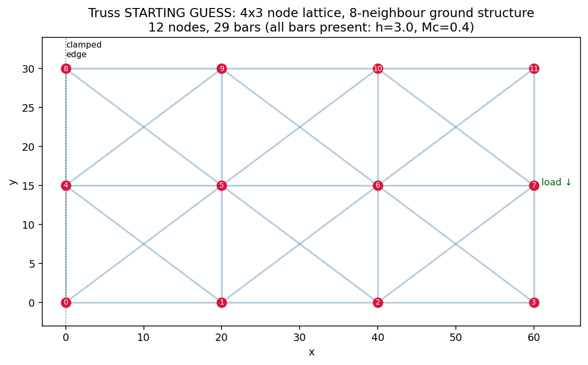

The payoff is the best result in this study:

| Parametrization | vars | baseline (sharp start) | + 5-step continuation |
|---|---|---|---|
| free bars (§4.5) | 108 | — | 76.08 |
| non-planar truss (12 nodes, 29 bars) | 82 | 91.2 | 79.3 |
| **planar truss (18 nodes, 41 bars)** | 118 | 89.8 | **74.25** |

A **single** continuation trajectory on the planar truss reaches **C = 74.25** — *below* the
free-bar optimum (76.08) and below everything the full global search reached on the free bars
(§4.5). The reasons are structural, not algorithmic:

* **Connectivity is free.** In the free formulation, "is the structure connected?" is something
  the optimizer must discover, and is the source of most bad basins. In the truss it holds by
  construction (bars share joints), so that entire class of traps disappears.
* **Crossings are real joints.** Planarizing removes the phantom-intersection degrees of freedom
  the optimizer would otherwise waste reconciling overlapping-but-unconnected members.
* **Fewer, better-conditioned variables.** Every variable is a joint position or a member size
  with a clear structural role, rather than a free-floating bar parameter with many degenerate
  configurations.
* **Continuation still does the annealing** (89.8 sharp → 74.25 smooth-started), exactly as in
  §4.5 — the initial smoothness remains the decisive knob.

| planar truss + continuation, C = 74.25 | optimized joints & bars |
|---|---|
| 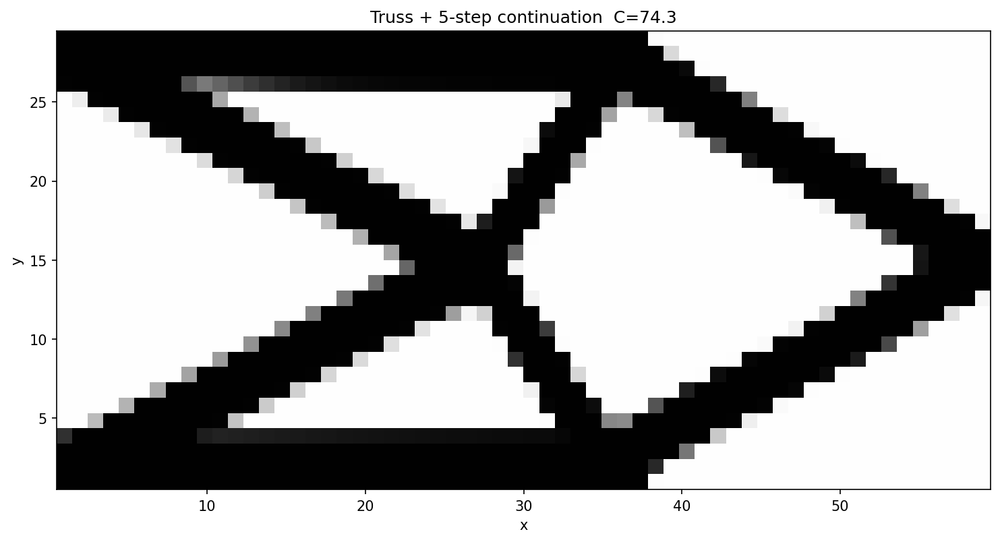 | 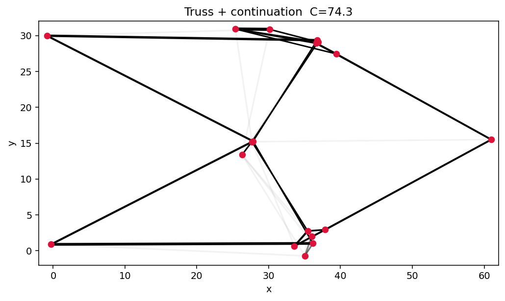 |

<!-- ROBUSTNESS -->

The lesson closes the study. After all the escape heuristics, **the minimum that beat the wall
came from reformulating the design space, not from a cleverer search of a fixed one.** In a
landscape this chaotic (§2.6), the highest-leverage move is to *remove* the ill-conditioned and
degenerate degrees of freedom — connectivity, phantom crossings — so that an ordinary
continuation can anneal cleanly into a good basin. Better conditioning beats harder searching.

## 5. Reproducing & extending

* Run a single strategy: `ggp search --preset short_cantilever --strategy continuation`.
* Add a new continuation schedule: pass a list of `overrides` dicts to
  `global_search.continuation`.
* New strategies plug in the same way (construct `GGPPipeline(spec, x0=..., overrides=...,
  deflation=...)`, read back `OptimisationResult`); the orchestration is FEniCS-free and
  unit-tested in `tests/test_global_search.py`.
* Run the node-based planar truss: `ggp optimize --preset short_cantilever_truss`. Change the
  node lattice with `grid_nx`/`grid_ny` and the ground-structure density with `truss_radius`
  in the preset; the connectivity (with crossing-node planarization) is built by
  `ggp.projection.truss_2d.build_ground_structure` and unit-tested in
  `tests/test_truss_mapper.py`.

## References
1. M. P. Bendsøe, O. Sigmund. *Topology Optimization: Theory, Methods, and
   Applications.* Springer, 2003.
2. O. Sigmund, K. Maute. *Topology optimization approaches.* Struct. Multidiscip.
   Optim. 48(6):1031–1055, 2013.
3. J. K. Guest, J. H. Prévost, T. Belytschko. *Achieving minimum length scale … using
   nodal design variables and projection functions.* IJNME 61(2):238–254, 2004.
4. F. Wang, B. S. Lazarov, O. Sigmund. *On projection methods, convergence and robust
   formulations in topology optimization.* SMO 43(6):767–784, 2011.
5. X. Guo, W. Zhang, W. Zhong. *Doing topology optimization explicitly and
   geometrically — a new moving morphable components based framework.* J. Appl. Mech.
   81(8), 2014.
6. W. Zhang, J. Yuan, J. Zhang, X. Guo. *A new topology optimization approach based on
   Moving Morphable Components (MMC) and the ersatz material model.* SMO 53:1243–1260,
   2016.
7. S. Coniglio, J. Morlier, C. Gogu, R. Amargier. *Generalized Geometry Projection: A
   unified approach for geometric feature based topology optimization.* Arch. Comput.
   Methods Eng. 27:1573–1610, 2020.
8. D. P. Wales, J. P. K. Doye. *Global optimization by basin-hopping …* J. Phys. Chem.
   A 101(28):5111–5116, 1997.
9. I. P. A. Papadopoulos, P. E. Farrell, T. M. Surowiec. *Computing multiple solutions
   of topology optimization problems.* SIAM J. Sci. Comput. 43(3):A1555–A1582, 2021.
10. K. Svanberg. *The method of moving asymptotes — a new method for structural
    optimization.* IJNME 24(2):359–373, 1987.
11. A. V. Levy, A. Montalvo. *The tunneling algorithm for the global minimization of
    functions.* SIAM J. Sci. Stat. Comput. 6(1):15–29, 1985.
12. R. P. Ge. *A filled function method for finding a global minimizer of a function of
    several variables.* Math. Programming 46:191–204, 1990.
13. E. Ott, C. Grebogi, J. A. Yorke. *Controlling chaos.* Phys. Rev. Lett.
    64(11):1196–1199, 1990.
14. K. Pyragas. *Continuous control of chaos by self-controlling feedback.* Phys. Lett.
    A 170(6):421–428, 1992.
15. L. Chen, K. Aihara. *Chaotic simulated annealing by a neural network model with
    transient chaos.* Neural Networks 8(6):915–930, 1995.
16. B. Li, W. Jiang. *Optimizing complex functions by chaos search.* Cybernetics and
    Systems 29(4):409–419, 1998.
